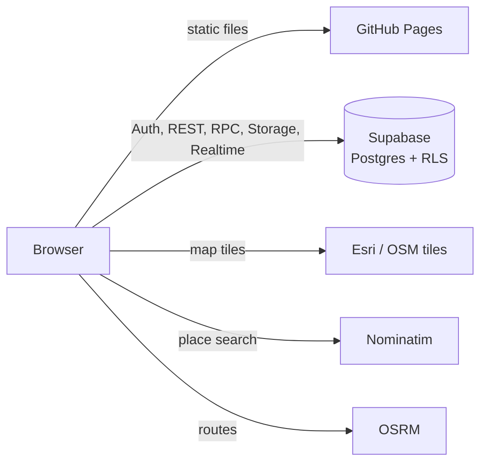

<div align="center">

<h1>CS Society</h1>

<p><strong>Report. Volunteer. Cleaner tomorrow.</strong><br>
A community platform where neighbors report local problems, volunteers claim and fix them, and everyone follows the progress on a live map.</p>

<p>
  
  
  
  
  
</p>

<p><a href="https://YOUR-USERNAME.github.io/cs-society/"><strong>Live site</strong></a></p>

</div>

---

## Table of contents

- [Features](#features)
- [Tech stack](#tech-stack)
- [Architecture](#architecture)
- [Project structure](#project-structure)
- [Getting started](#getting-started)
- [Deployment](#deployment)
- [Configuration reference](#configuration-reference)
- [Database](#database)
- [Security](#security)
- [Troubleshooting](#troubleshooting)
- [Roadmap](#roadmap)
- [Production checklist](#production-checklist)
- [Credits](#credits)

---

## Features

**For residents**
- Report litter, illegal dumping, damaged property, overflowing bins and more in a few taps.
- Drop a pin on a real map, or use the device location.
- Follow every update on a timeline, with before and after photos.

**For volunteers**
- Browse open reports on a map, filtered by category, status and distance.
- Claim a task, then get **walking or driving directions** to it, with live location tracking.
- Post progress updates and mark the job resolved.

**For everyone**
- Email sign-up and sign-in, password reset, and one account that can be both a resident and a volunteer.
- Profile with a map-based location picker.
- Responsive, accessible interface in a white and green design.

---

## Tech stack

| Layer | Technology |
| --- | --- |
| Frontend | Static single page: HTML, CSS and vanilla JavaScript (no build step) |
| Maps | [Leaflet](https://leafletjs.com/) with Esri World Street Map tiles (OpenStreetMap fallback) |
| Geocoding | [Nominatim](https://nominatim.org/) (OpenStreetMap) |
| Routing | [OSRM](https://project-osrm.org/) through `routing.openstreetmap.de` |
| Auth, database, storage | [Supabase](https://supabase.com/) (PostgreSQL, Row Level Security, Storage, Realtime) |
| Hosting | GitHub Pages |

---

## Architecture

GitHub Pages serves only static files. All dynamic work happens in Supabase, which the browser calls directly. Security is enforced in the database with Row Level Security, not in the page.



---

## Project structure

```
cs-society/
├── index.html          # The whole app: markup, styles and scripts
├── config.js           # Supabase URL and publishable key (safe to publish)
├── .nojekyll           # Tells GitHub Pages to serve files as they are
├── README.md
└── supabase/
    └── schema.sql      # Tables, RLS policies, functions, storage, realtime
```

---

## Getting started

### Prerequisites

- A free [Supabase](https://supabase.com/) account
- A free [GitHub](https://github.com/) account
- [VS Code](https://code.visualstudio.com/) with the **Live Server** extension (or any static file server)

### 1. Create the Supabase project

1. In Supabase click **New project**. Choose a name, a strong database password and the nearest region.
2. Open **SQL Editor, New query**, paste the full contents of [`supabase/schema.sql`](supabase/schema.sql) and click **Run**. You should see **Success**.
3. Open **Authentication, Sign In / Providers** and check that **Allow new users to sign up** and the **Email** provider are on.
4. For local testing, turn **Confirm email** off. See the [production checklist](#production-checklist) for turning it back on.

### 2. Add your project keys

Open **Project Settings, API** and copy the **Project URL** and the **publishable** (anon) key into `config.js`:

```js
window.CS_CONFIG = {
  SUPABASE_URL: "https://YOUR-PROJECT-ID.supabase.co",
  SUPABASE_ANON_KEY: "sb_publishable_..."
};
```

> [!WARNING]
> Never put the `secret` or `service_role` key in this repository. It bypasses every security rule.

### 3. Run it locally

Open the folder in VS Code and use **Go Live** (Live Server). Or from a terminal in the project folder:

```bash
python -m http.server 5500
# then open http://127.0.0.1:5500
```

Do not open `index.html` by double-clicking it. Authentication and location need `http://localhost` or `https://`.

### 4. Check that it works

1. Create an account, then sign out and sign in again.
2. In Supabase open **Table Editor, profiles**. Your account should be listed.
3. Change your location in your profile and refresh. It should be remembered.

---

## Deployment

1. Push the repository to GitHub as a **public** repository named `cs-society`.
2. Open **Settings, Pages**. Under **Build and deployment** choose **Deploy from a branch**, branch **main**, folder **/ (root)**, then **Save**.
3. After a minute the site is live at `https://YOUR-USERNAME.github.io/cs-society/`.
4. In Supabase open **Authentication, URL Configuration** and set:
   - **Site URL**: your GitHub Pages address
   - **Redirect URLs**: the same address, plus `http://127.0.0.1:5500/**` for local testing

Every push to `main` redeploys the site.

---

## Configuration reference

| Key | Where | Purpose |
| --- | --- | --- |
| `SUPABASE_URL` | `config.js` | Your project address, for example `https://abcd1234.supabase.co` |
| `SUPABASE_ANON_KEY` | `config.js` | The publishable key. Public by design, protected by RLS |

If `config.js` is left with the placeholders, the app falls back to a local-only mode that stores data in the browser. This is useful for design work, but nothing is shared between users.

---

## Database

The schema is created by [`supabase/schema.sql`](supabase/schema.sql).

**Tables**

| Table | Purpose | Who can read |
| --- | --- | --- |
| `profiles` | Public profile: name, photo, roles | Everyone |
| `user_settings` | Private location, notification choices, volunteer hours | Owner only |
| `issues` | Reports with category, status and coordinates | Everyone |
| `issue_events` | Timeline: reported, claim, release, status, note | Everyone |
| `notifications` | Per-user notifications | Owner only |
| `flags` | Reports to moderators | Admins only |

**Functions (RPC)**

Reports are never edited directly. They change only through these functions, which check who is calling.

| Function | What it does |
| --- | --- |
| `create_issue(...)` | Validates and creates a report and its first timeline entry. Limited to 10 reports per hour per user |
| `claim_issue(id)` | A volunteer claims a `New` report. Fails if someone else already did |
| `release_issue(id)` | The claiming volunteer puts the report back to `New` |
| `post_update(id, text, status, photo, hours)` | Adds a note or moves the status to `In Progress` or `Resolved` |
| `flag_issue(id, reason)` | Sends a report to moderators |
| `nearby_issues(lat, lng, radius_km)` | Returns reports within a radius, closest first |

**Storage:** a public `photos` bucket limited to 2 MB and JPEG, PNG or WebP. Each user can upload only into their own folder.

**Realtime:** enabled for `issues`, `issue_events` and `notifications`.

---

## Security

- **Row Level Security** is on for every table. Anonymous visitors can read public data and nothing else.
- **Column-level grants** let users edit only their own name, photo, roles, location and notification choices. Fields such as `is_admin` and `hours` cannot be changed from the browser.
- **Writes go through `SECURITY DEFINER` functions** that check the caller and the report state.
- **Rate limiting** on report creation.
- **The publishable key is safe to expose.** Anyone can read it from the page, and the policies above are what protect the data.
- **Privacy:** private location data is stored in `user_settings` and is never returned to other users.

---

## Troubleshooting

| Problem | Cause and fix |
| --- | --- |
| `Email signups are disabled` | Turn on **Allow new users to sign up** under **Authentication, Sign In / Providers**. |
| `email rate limit exceeded` | Supabase's built-in email sender allows only a few emails per hour. Turn **Confirm email** off for testing, wait about an hour, or [set up custom SMTP](https://supabase.com/docs/guides/auth/auth-smtp) for production. |
| Confirmation links open `localhost:3000` | Set **Site URL** under **Authentication, URL Configuration** to your real address. |
| Live Server is missing from the right-click menu | Click **Manage, Trust** in VS Code's Restricted Mode bar, then install the **Live Server** extension. |
| Blank page or buttons do nothing | Open DevTools (**F12**), then **Console**. Check that `config.js` has real values inside quotation marks, and that you are not opening the file directly. |
| Map is grey or shows no tiles | Check your internet connection. The map, place search and directions all need to be online. |
| Location button does nothing | Location needs `https://` or `localhost`. Allow the permission in the browser's address bar. |
| Changes do not show after deploying | Hard refresh with **Ctrl + Shift + R**. GitHub Pages can take a minute or two to update. |

---

## Roadmap

- [x] **Stage 1:** authentication, profiles, saved location, map, live location, directions
- [ ] **Stage 2:** reports, claims, updates and resolving stored in the database
- [ ] **Stage 3:** photo uploads to Supabase Storage
- [ ] **Stage 4:** real-time notifications and live list updates
- [ ] **Stage 5:** moderation and an admin dashboard
- [ ] **Stage 6:** forward reports to the local authority, impact reports

> [!NOTE]
> Until Stage 2 is complete, reports are still stored in each person's own browser, so different users do not see each other's reports.

---

## Production checklist

- [ ] Turn **Confirm email** back **on**
- [ ] Connect a custom email sender (SMTP) so confirmation emails are reliable
- [ ] Use a custom domain, and update **Site URL** and **Redirect URLs** in Supabase
- [ ] Move to a map, search and routing provider that allows production traffic. The free public services have usage limits
- [ ] Add a privacy policy and terms, with consent for location and photos
- [ ] Enable database backups
- [ ] Add error monitoring
- [ ] Add a `LICENSE` file

---

## Credits

- Map data © [OpenStreetMap](https://www.openstreetmap.org/copyright) contributors
- Map tiles © Esri, HERE, Garmin and OpenStreetMap contributors
- [Leaflet](https://leafletjs.com/), [Supabase](https://supabase.com/), [OSRM](https://project-osrm.org/), [Nominatim](https://nominatim.org/)
- Fonts: Plus Jakarta Sans and Inter, through Google Fonts